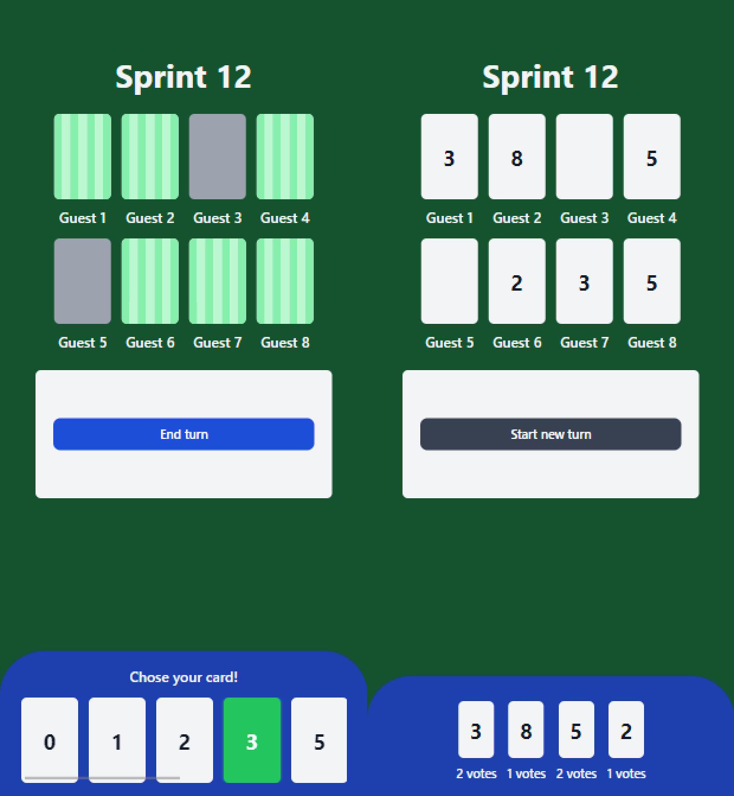
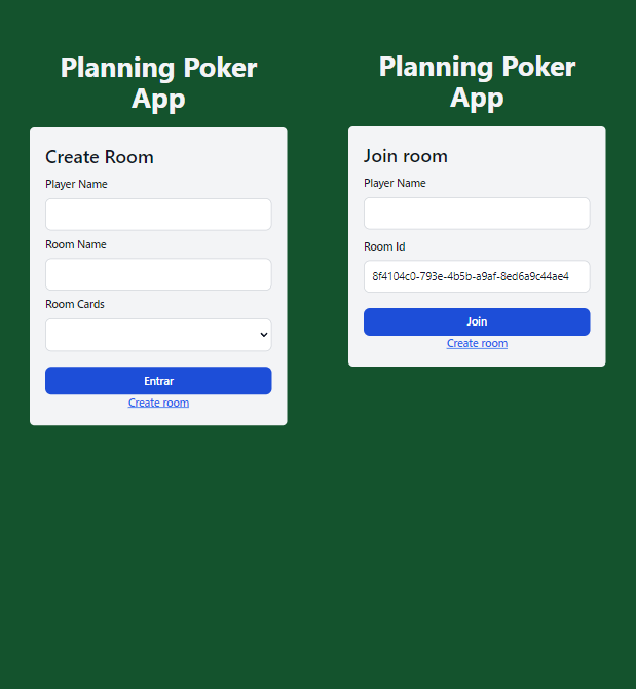

#  Planning Poker App

A real-time application game that helps teams plan their sprints using the **Planning** Poker method.

**Planning Pocker App** is a small project to help me learn **Svelte**, **NginX**, **EC2**, and **WebSockets**.

    

With the app, the user can:

- Create a room informing: player's name, room's name, and the voting system.
- Share the room by copying the page URL.
- Join an existing room by entering the shared URL.

    

The game works as follows:

- Every turn represents a task that the team is attempting to estimate.
- Players can choose a card they think best represents the task complexity.
- At any point, any player can end the turn revealing everyone's selections.
- If there is consensus about the task estimate, the team can move on to the next task. Otherwise, they can initiate a new turn for the same task.

### Technologies

- Figma for the initial prototype and logo.
- [Svelte](https://svelte.dev/) for the UI buinding.
- [Svelte Kit](https://kit.svelte.dev/) as the SSR provider.
- [Tailwind CSS](https://tailwindcss.com/) for styling.
- [Socket.IO](https://socket.io/) for real-time server communication.
- [AWS EC2]() and [NginX](https://www.nginx.com/) for the virtual machine and HTTP server. This is necessary as maintaining a WebSocket connection within Vercel is challenging due to their use of serverless functions for deployment. [Click here for more info](https://vercel.com/guides/do-vercel-serverless-functions-support-websocket-connections).
